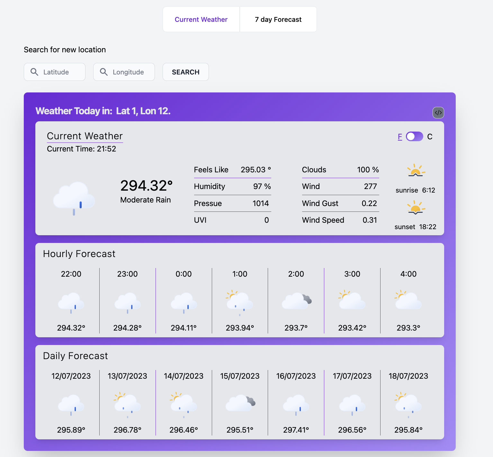

<a name="readme-top"></a>
<div align="center">
<h3 align="center">Cool Weather App</h3>

  <p align="center">
    A Weather Application built with openweathermap.org API.
  </p>

  
</div>

## Built With

* [React.js](https://react.dev/) - For UI
* [Flowbite](https://flowbite.com/) - For rapid UI development
* [react-router-dom](https://reactrouter.com/en/main) - For routing
* [Axios](https://axios-http.com/docs/intro) - For data fetching
* [SWR](https://swr.vercel.app/) - for data caching
* [Vite](https://vitejs.dev/) - For front end tooling
* and more...

<p align="right">(<a href="#readme-top">back to top</a>)</p>

## Getting Started

The project is not hosted anywhere so the only way to view it is locally. To get stated, clone the repositiory, do a yarn install, and start the server. Here's a step by step guide:

1. Clone the repo
   ```sh
   git clone https://github.com/norvalbv/cool-weather-app
   ```
2. Install yarn packages
   ```sh
   yarn install
   ```
3. Get the an API key from: https://home.openweathermap.org/api_keys

4. Create an .env.local file in src and enter your API key. This .env.local will override your .env file.
   ```js
   API_KEY=<<YOUR KEY>>
   ```

<p align="right">(<a href="#readme-top">back to top</a>)</p>